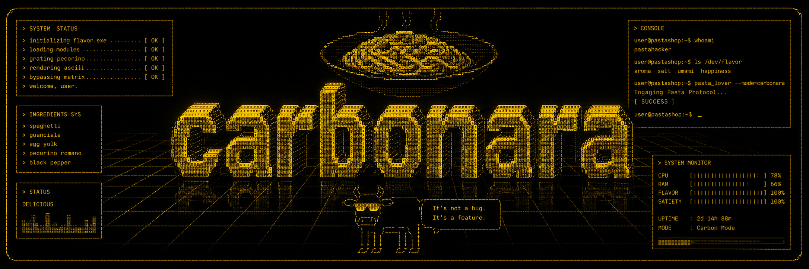

# Carbonara

Tech feeds in your terminal cooked al dente with Zig.



## Features

- **Trending repositories** - View the trending repositories on GitHub.
- **Hacker News** - View the top stories on Hacker News.
- **Product Hunt** - View the top stories on Product Hunt.
- **ArXiv** - View the top papers on ArXiv.
- **RSS Feeds** - View the top stories from any RSS feed.

## Intallation

### From Source

```sh
git clone https://github.com/atasoya/carbonara.git
cd carbonara
zig build # and link the binary to your $PATH
```

### Homebrew

```sh
brew tap atasoya/carbonara
brew install carbonara
```

### Bash Installer

```sh
curl -fsSL https://raw.githubusercontent.com/atasoya/carbonara/main/install.sh | sh
```

## Configuration

Carbonara reads its configuration from `$HOME/.config/carbonara/config.json`.

```json
{
  "rss_feeds": [
    "https://ziglang.org/news/index.xml",
  ]
}
```

### Setting up Product Hunt

To enable Product Hunt, set the `PRODUCT_HUNT_TOKEN` environment variable to your token.

```sh
export PRODUCT_HUNT_TOKEN=your-token
```

## Showcase


